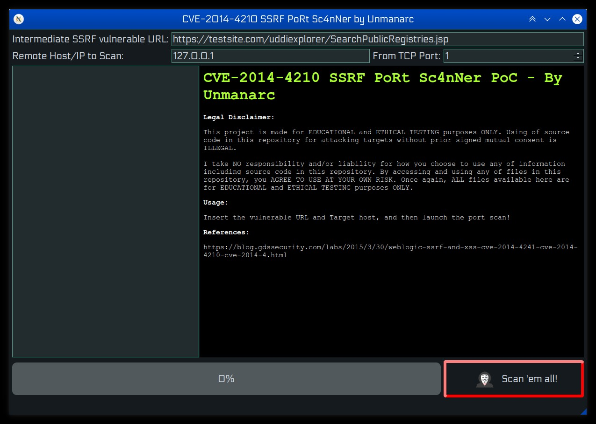

# CVE-2014-4210 SSRF PORTSCANNER PoC

Author: Aaron Mizrachi (unmanarc) <aaron@unmanarc.com>  
Twitter: https://twitter.com/unmanarc  
License: LGPLv3   

## Liability / Legal Disclaimer

This project is made for EDUCATIONAL and ETHICAL TESTING purposes ONLY. Using of source code in this repository for attacking targets without prior signed mutual consent is ILLEGAL.

I take NO responsibility and/or liability for how you choose to use any of information including source code in this repository. By accessing and using any of files in this repository, you AGREE TO USE AT YOUR OWN RISK. Once again, ALL files available here are for EDUCATIONAL and ETHICAL TESTING purposes ONLY.


## Functionality

This program is a proof of concept of CVE-2014-4210 bug present in WebLogic. 

It takes advantage of the SSRF bug to check if some port is open or closed, 
It can be used to port scan remote ports. 



## References

* https://blog.gdssecurity.com/labs/2015/3/30/weblogic-ssrf-and-xss-cve-2014-4241-cve-2014-4210-cve-2014-4.html

## How it works

uddi explorer uses JS to display the web, so it was not easy to make a console-based JS interpreter to decode the information (like a curl with bash). 

therefore, I opted to use a embedded web browser to execute the request with the SSRF vulnerability. This runs in a loop and gets remote open ports.

## How to build

first download/clone this repo and cd into it, then:

```
qmake-qt5 .
make
```

You may also use qtcreator to build, just open the .pro project file with it and run. 

